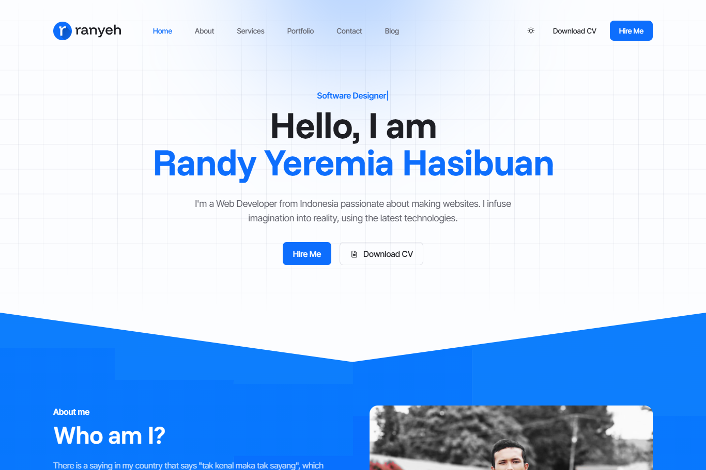

# Randy Hasibuan - Portfolio

## Description

My design of personal portfolio website. This is just a website template, not the real one.

## Preview

## Technologies Used

- HTML
- CSS
- JavaScript
- [Tailwind CSS](https://tailwindcss.com)

## Libraries Used

- [Spotlight](https://nextapps-de.github.io/spotlight)
- [Typed.js](https://mattboldt.com/demos/typed-js)
- [Popper](https://popper.js.org)
- [highlight.js](https://highlightjs.org)
- [clipboard.js](https://clipboardjs.com)

## Icon Libraries Used

- [Font Awesome](https://fontawesome.com)
- [Unicons](https://iconscout.com/unicons)
- [Lineicons](https://lineicons.com)
